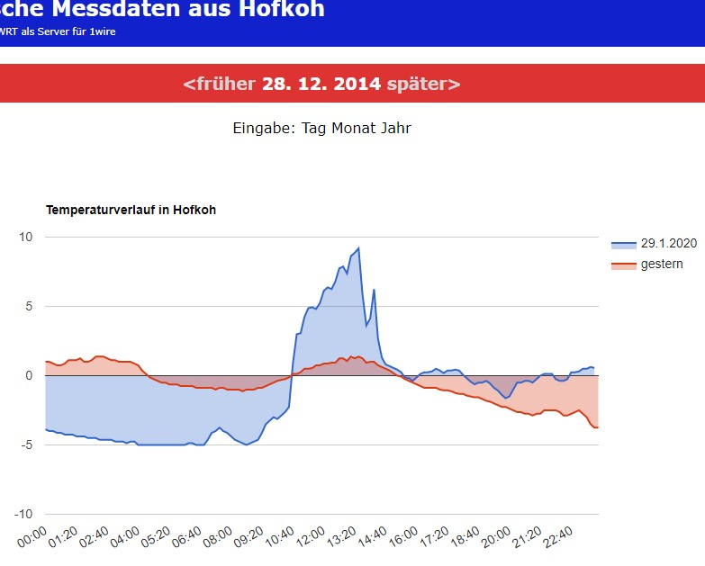
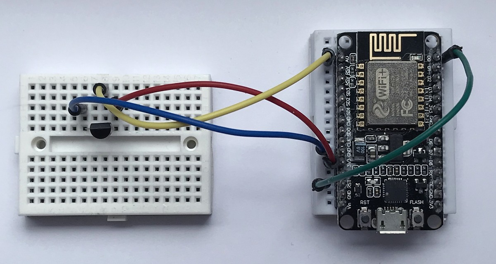

# temp.hofkoh.de

This project measures the outdoor temperature in Hofkoh. Results are published and visualized in the web.

## 2013 - 2016

It ran from 2013 to 2016 and collected data of lower Saxony.

Detailed description in [software](software).

## Documentation 2013

I created a pdf document that documents all building and programming steps for this project. It can be found in the [documentation](https://github.com/kreier/temp.hofkoh.de/blob/main/documentation/info.pdf) folder.

## Update 2020

The history function was finally made to work.

... picture and link follow

## New station in Ho Chi Minh City

In 2020 it was updated to Ho Chi Minh City. And with an ESP8266 and LM35 the station costs only 3.77 € compared to 53.39 € for WR703N and DS18S20 with DS9490R OneWire USB adapter.

## Hardware documentation 2020

In 2013:

- TP-Link WR703N ([at aliexpress 2020](https://www.aliexpress.com/item/32871332539.html) for 34.25 USD
- DS18S20 ([DS18B20](https://icdayroi.com/ds18b20) for 22.000₫ = 0.95 USD)
- DS9490R OneWire USB adapter [DS9490R USB:1-Wire RJ11 Adapter](https://www.aliexpress.com/item/32295178029.html) for 27.50 USD

In 2020:

- ESP8266 ([Arduino ESP8266 NodeMcu Lua WIFI V3](https://icdayroi.com/arduino-nodemcu-lua-wifi-v3) for 78.000₫ = 3.38 USD)
- LM35 ([LM35DZ/NOPB](https://icdayroi.com/lm35dz-nopb) for 20.000₫ = 0.87 USD)

## Hardware comarison 2026

I made a markdown table

|              | TL-WR703N      | ESP8266        |
|--------------|----------------|----------------|
| CPU          | Atheros AR9331 | Tensilica L106 |
| Architecture | MIPS 24Kc      | Xtensa         |
| MHz          |            400 |            160 |
| RAM          | 32 MB          | 160 KB         |
| Flash        | 4 MB           | 4 MB           |
| WLAN         | b/g/n          | b/g/n          |
| Kernel       | 3.3.8          |                |
| release      |     2012-08-21 |                |

## Original Firmware

This is from 2015, support ended a while ago: 

- TP-Link - https://www.tp-link.com/us/support/download/tl-wr702n/#Firmware
- OpenWRT - https://openwrt.org/toh/tp-link/tl-wr703n
- https://oldwiki.archive.openwrt.org/toh/tp-link/tl-wr702n

